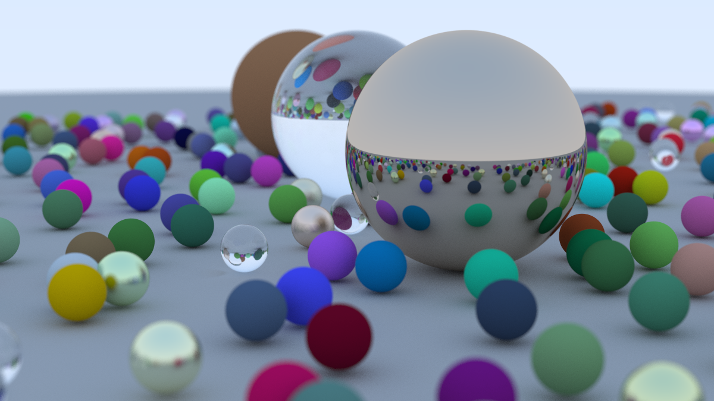
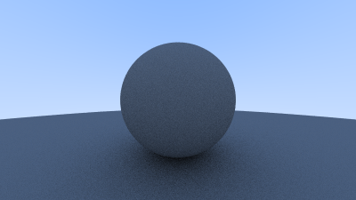
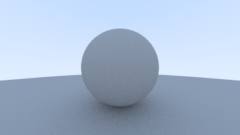
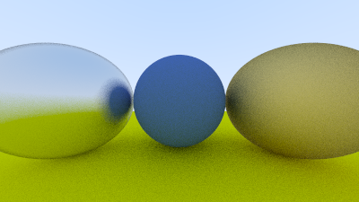
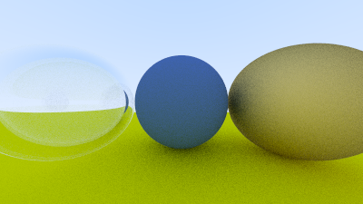
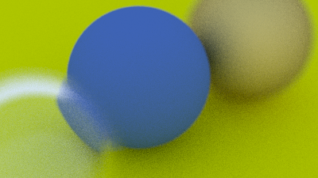

# Raytracer
Learning project following the [Ray Tracing in One Weekend](https://raytracing.github.io/) book
# Learning goals
Learn the basics of Computer graphics programming
# Build
* Build using CMake
* Run executable to render a scene

Pipe the created executable into an image with the *.ppm* extension
* Example on Windows:
`./build/Raytracing.exe > image.ppm`

# Images
See progression in /img folder  

